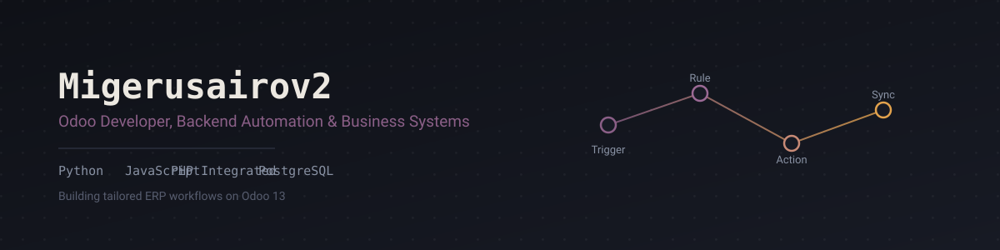

I build and customize **Odoo ERP** systems — tailored workflows, automation rules, and the backend logic that makes a business run on fewer manual steps.

---

## Featured

### [Odoo Custom Addons](https://github.com/Migerusairov2/custom_addons)
Custom **Odoo 13** modules extending core functionality — tailored workflows, automation rules, and business logic extensions.

---

## Languages & Tools

---

---

Open to Odoo & backend automation projects — reach out via a GitHub issue or the contact info on my profile.

